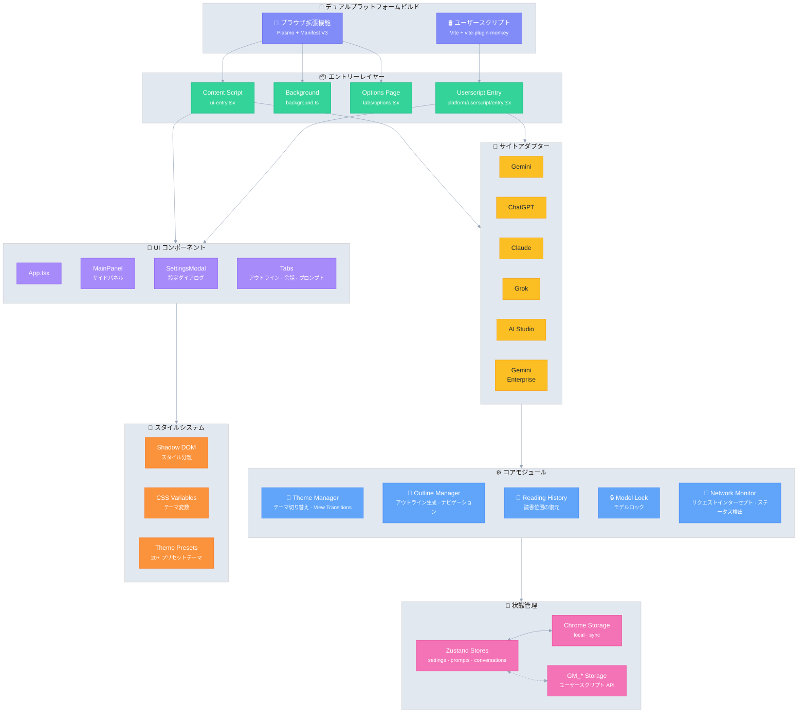

# Ophel Atlas 🚀

> AI チャットをドキュメントのように読みやすく、ナビゲートしやすく、再利用可能に

<div align="center">
  

  <h3 style="margin-top: -2px;">✨ 会話をただの履歴ではなく、知識へ ✨</h3>
  
  <p>
    無限スクロールによる情報の迷宮に別れを告げよう
    </br>
    リアルタイムのアウトラインで文脈を整理し、
    </br>
    会話フォルダで体系を構築し、
    </br>
    プロンプトライブラリで経験を蓄積し、
    </br>
    煌めく思考を秩序の中で自由に解き放とう
  </p>
  
  <p align="center" style="font-size: 12px; color: #555;">👇 デモ：「無限スクロールのチャット履歴」から「ナビ可能なAIドキュメント」へ</p>

  
  
  <p>
    <strong><em>AIチャットを初めて「整理可能なワークフロー」にします</em></strong><br/>
  </p>

  <small style="opacity: 0.6;">
  どのプラットフォームを使用していても、一貫した、整理可能で再利用可能な体験を得ることができます
  </small>
  <p>
    <a href="https://chatgpt.com"></a>
    <a href="https://gemini.google.com"></a>
    <a href="https://grok.com"></a>
    <a href="https://claude.ai"></a>
    <a href="https://aistudio.google.com"></a>
    <a href="https://business.gemini.google/"></a>
    <a href="https://github.com/urzeye/ophel/issues"></a>
    </br>
    
    <a href="../../LICENSE"></a>
    
    <a href="https://github.com/urzeye/ophel/stargazers"></a>
    <a href="https://github.com/urzeye/ophel/network/members"></a>
    </br>
    <a href="https://chromewebstore.google.com/detail/ophel-ai-%E5%AF%B9%E8%AF%9D%E5%A2%9E%E5%BC%BA%E5%B7%A5%E5%85%B7/lpcohdfbomkgepfladogodgeoppclakd"></a>
    <a href="https://addons.mozilla.org/zh-CN/firefox/addon/ophel-ai-chat-enhancer/"></a>
    <a href="https://greasyfork.org/zh-CN/scripts/563646-ophel-ai-chat-page-enhancer"></a>
  </p>

</div>

<!-- Promo Link -->
<p align="center">
  📣 <a href="https://github.com/urzeye/ophel/issues/30">
    <strong>Help promote Ophel Atlas</strong>
  </a>
  <br/>
  <a href="https://www.producthunt.com/products/ophel?embed=true&utm_source=badge-featured&utm_medium=badge&utm_campaign=badge-ophel" target="_blank" rel="noopener noreferrer"></a>
</p>

<p align="center">
  <a href="#-デモ">デモ</a> •
  <a href="#-主な機能">主な機能</a> •
  <a href="#-今すぐ始める">今すぐ始める</a> •
  <a href="#%EF%B8%8F-技術アーキテクチャ">技術アーキテクチャ</a> •
  <a href="#-プロジェクトを支援">プロジェクトを支援</a>
</p>

<p align="center">
  🌐 <a href="../../README_EN.md">English</a> | <a href="../../README.md">简体中文</a> | <a href="./README_zh-TW.md">繁體中文</a> | <strong>日本語</strong> | <a href="./README_ko.md">한국어</a> | <a href="./README_de.md">Deutsch</a> | <a href="./README_fr.md">Français</a> | <a href="./README_es.md">Español</a> | <a href="./README_pt.md">Português</a> | <a href="./README_ru.md">Русский</a>
</p>

## 📹 デモ

|                                                        大綱 Outline                                                        |                                                     会話 Conversations                                                     |                                                       機能 Features                                                        |
| :------------------------------------------------------------------------------------------------------------------------: | :------------------------------------------------------------------------------------------------------------------------: | :------------------------------------------------------------------------------------------------------------------------: |
| <video src="https://github.com/user-attachments/assets/a40eb655-295e-4f9c-b432-9313c9242c9d" width="280" controls></video> | <video src="https://github.com/user-attachments/assets/a249baeb-2e82-4677-847c-2ff584c3f56b" width="280" controls></video> | <video src="https://github.com/user-attachments/assets/6dfca20d-2f88-4844-b3bb-c48321100ff4" width="280" controls></video> |

## 想定される利用シーン

- 学習・研究：長文対話での推論、知識の整理、結論の振り返り、ノート抽出
- 日常業務：要件分解、提案書作成、競合分析、議事録、相談・マネジメントのワークフロー
- 開発・技術執筆：長いコード議論、バグ調査、アーキテクチャ検討、ドキュメント/ブログ執筆
- コンテンツ制作：台本/アウトライン/推敲の反復、重要箇所へ素早く戻り、書き出して再編集
- AIを高頻度で使う人：一時的なチャットではなく「構造・秩序・再利用性」が必要

## ✨ 主な機能

- 🧠 **スマートアウトライン** — ユーザーの質問と AI の回答を自動解析し、ナビゲーション可能な目次を生成
- 💬 **会話管理** — フォルダ分類、タグ付け、検索、一括操作
- ⌨️ **プロンプトライブラリ** — 変数サポート、Markdown プレビュー、分類管理、ワンクリック入力
- 🎨 **テーマカスタマイズ** — 20種類以上のダーク/ライトテーマ、カスタムCSS
- 🔧 **インターフェース最適化** — ワイドスクリーンモード、ページと質問幅の調整、サイドバーレイアウト制御
- 📖 **読書体験** — スクロールロック、読書履歴の復元、Markdown レンダリングの最適化
- ⚡ **効率化ツール** — ショートカットキー、モデルロック、タブ自動リネーム、完了通知
- 🎭 **Claude 拡張** — Session Key 管理、マルチアカウント切り替え
- 🔒 **プライバシー優先** — ローカルストレージ、WebDAV 同期、データ収集なし

<details>
<summary>プライバシーとデータ（クリックで展開）</summary>

**Ophel Atlas** はプライバシー最優先：既定はローカル保存で、データはあなたの管理下にあります。

- **既定でローカル保存：** 設定・プロンプト・会話管理データはブラウザ内に保存
- **アカウント不要：** 登録なしで利用可能
- **必要時のみ権限：** オプション権限は必要時だけ要求し、いつでも取り消し可能（拡張機能の Permissions ページ参照）
- **任意の WebDAV 同期：** 自分の WebDAV で複数端末同期（管理可能・移行容易）
- **エクスポート/バックアップ：** 書き出しと移行に対応、ロックイン回避

</details>

> 注：特定のAIサイトへの対応は、サイト判定とページ構造の変更に依存します。

## 🚀 今すぐ始める

> [!tip]
>
> **ブラウザ拡張機能（Extension）版の使用を推奨します**。機能が充実しており、体験も優れ、互換性も高いです。Tampermonkey（Userscript）版は機能が制限されています。

### アプリストア

<a href="https://chromewebstore.google.com/detail/ophel-ai-%E5%AF%B9%E8%AF%9D%E5%A2%9E%E5%BC%BA%E5%B7%A5%E5%85%B7/lpcohdfbomkgepfladogodgeoppclakd"></a>
<a href="https://addons.mozilla.org/zh-CN/firefox/addon/ophel-ai-chat-enhancer/"></a>
<a href="https://greasyfork.org/zh-CN/scripts/563646-ophel-ai-chat-page-enhancer"></a>

### 手動インストール

#### ブラウザ拡張機能

1. [Releases](https://github.com/urzeye/ophel/releases/latest) からインストールパッケージをダウンロードして解凍します
2. ブラウザの拡張機能管理ページを開き、**デベロッパーモード**を有効にします
3. **パッケージ化されていない拡張機能を読み込む**をクリックし、解凍したフォルダを選択します

#### Tampermonkey スクリプト

1. [Tampermonkey](https://www.tampermonkey.net/) プラグインをインストールします
2. [Releases](https://github.com/urzeye/ophel/releases) から `.user.js` ファイルをダウンロードします
3. ブラウザにドラッグするか、リンクをクリックしてインストールします

### ローカルビルド

<details>
<summary>ビルド手順を展開</summary>

**要件**: Node.js >= 20.x, pnpm >= 9.x

```bash
git clone https://github.com/urzeye/ophel.git
cd ophel

pnpm install
pnpm dev              # 開発モード
pnpm build            # Chrome/Edge 本番ビルド
pnpm build:firefox    # Firefox 本番ビルド
pnpm build:userscript # Userscript 本番ビルド
```

</details>

## 🏗️ 技術アーキテクチャ

**技術スタック**：[Plasmo](https://docs.plasmo.com/) + [React](https://react.dev/) + [TypeScript](https://www.typescriptlang.org/) + [Zustand](https://github.com/pmndrs/zustand)

<details>
<summary>📐 アーキテクチャ図（クリックして展開）</summary>



</details>

### 🐛 バグ報告

問題や提案がある場合は、[GitHub Issues](https://github.com/urzeye/ophel/issues) でフィードバックしてください。

## ⭐ Star History

<a href="https://star-history.com/#urzeye/ophel&Date">
 <picture>
   <source media="(prefers-color-scheme: dark)" srcset="https://api.star-history.com/svg?repos=urzeye/ophel&type=Date&theme=dark" />
   <source media="(prefers-color-scheme: light)" srcset="https://api.star-history.com/svg?repos=urzeye/ophel&type=Date" />
   
 </picture>
</a>

## 💖 プロジェクトを支援

<p align="center">
  <em>"If you want to go fast, go alone. If you want to go far, go together."</em>
</p>

<p align="center">
  もし Ophel があなたのワークフローや学習に役立ったなら、Star や Sponsor での支援をご検討ください。
</p>

<p align="center">
  Made with ❤️ by <a href="https://github.com/urzeye">urzeye</a>
</p>

## 📜 ライセンス

本プロジェクトは **CC BY-NC-SA 4.0** ライセンスの下で提供されています。詳細は [LICENSE](../../LICENSE) を参照してください。

> ⚠️ **商用パッケージ化、転売、または無許可の統合は禁止されています。** 商用ライセンスについてはお問い合わせください：**<igodu.love@gmail.com>**
