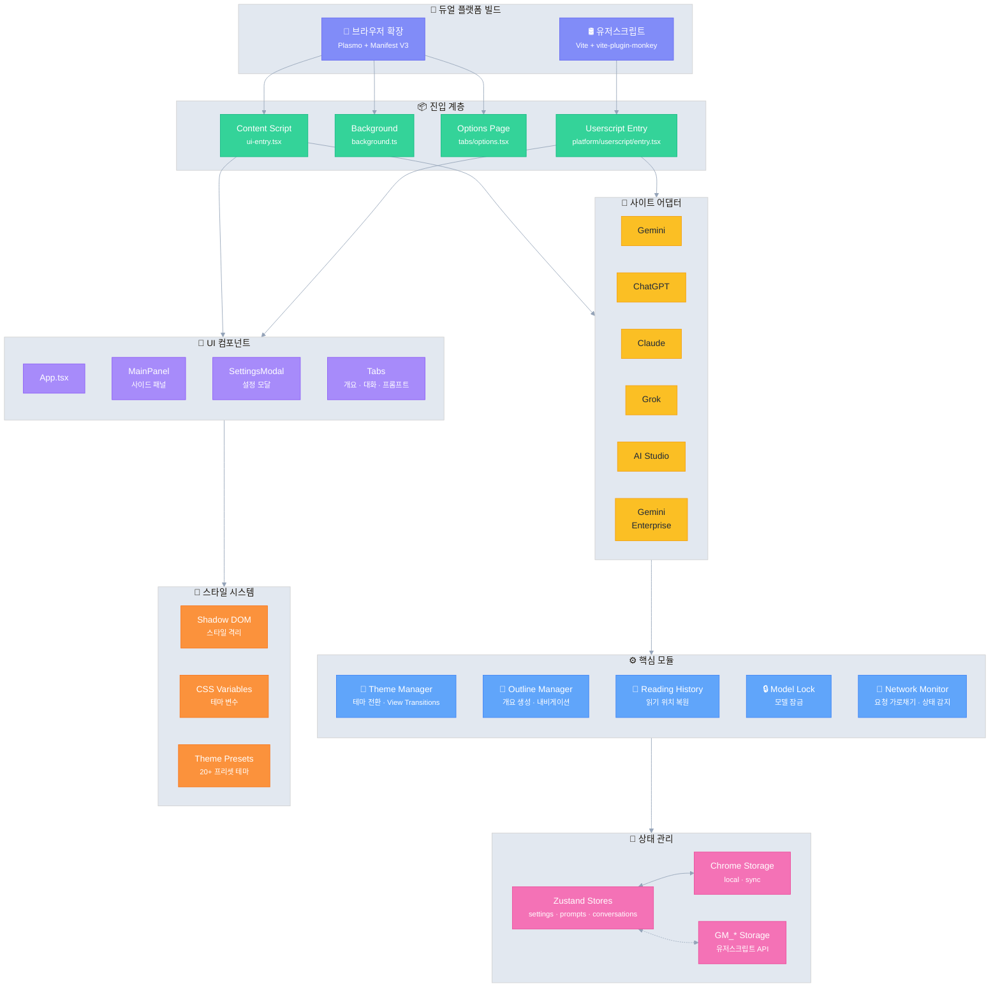

# Ophel Atlas 🚀

> AI 대화를 문서처럼 읽기 쉽고, 탐색 가능하며, 재사용할 수 있게 만듭니다

<div align="center">
  

  <h3 style="margin-top: -2px;">✨ 대화를 단순한 기록이 아닌 지식으로 바꾸세요 ✨</h3>
  
  <p>
    무한 스크롤 속 정보의 미궁과 작별하세요
    </br>
    실시간 개요로 맥락을 정리하고,
    </br>
    대화 폴더로 체계를 구축하며,
    </br>
    프롬프트 라이브러리로 경험을 축적하고,
    </br>
    반짝이는 생각들이 질서 속에서 자유롭게 흐르게 하세요
  </p>
  
  <p align="center" style="font-size: 12px; color: #555;">👇 데모: "무한 스크롤 채팅 기록"에서 "탐색 가능한 AI 문서"로</p>

  
  
  <p>
    <strong><em>AI 채팅을 처음으로 정리 가능한 워크플로우로 만듭니다</em></strong><br/>
  </p>

  <small style="opacity: 0.6;">
  어떤 플랫폼을 사용하든, 일관되고 정리 가능하며 재사용 가능한 경험을 얻을 수 있습니다
  </small>
  <p>
    <a href="https://chatgpt.com"></a>
    <a href="https://gemini.google.com"></a>
    <a href="https://grok.com"></a>
    <a href="https://claude.ai"></a>
    <a href="https://aistudio.google.com"></a>
    <a href="https://business.gemini.google/"></a>
    <a href="https://github.com/urzeye/ophel/issues"></a>
    </br>
    
    <a href="../../LICENSE"></a>
    
    <a href="https://github.com/urzeye/ophel/stargazers"></a>
    <a href="https://github.com/urzeye/ophel/network/members"></a>
    </br>
    <a href="https://chromewebstore.google.com/detail/ophel-ai-%E5%AF%B9%E8%AF%9D%E5%A2%9E%E5%BC%BA%E5%B7%A5%E5%85%B7/lpcohdfbomkgepfladogodgeoppclakd"></a>
    <a href="https://addons.mozilla.org/zh-CN/firefox/addon/ophel-ai-chat-enhancer/"></a>
    <a href="https://greasyfork.org/zh-CN/scripts/563646-ophel-ai-chat-page-enhancer"></a>
  </p>

</div>

<!-- Promo Link -->
<p align="center">
  📣 <a href="https://github.com/urzeye/ophel/issues/30">
    <strong>Help promote Ophel Atlas</strong>
  </a>
  <br/>
  <a href="https://www.producthunt.com/products/ophel?embed=true&utm_source=badge-featured&utm_medium=badge&utm_campaign=badge-ophel" target="_blank" rel="noopener noreferrer"></a>
</p>

<p align="center">
  <a href="#-기능-데모">기능 데모</a> •
  <a href="#-핵심-기능">핵심 기능</a> •
  <a href="#-시작하기">시작하기</a> •
  <a href="#%EF%B8%8F-기술 아키텍처">기술 아키텍처</a> •
  <a href="#-프로젝트-후원">프로젝트 후원</a>
</p>

<p align="center">
  🌐 <a href="../../README_EN.md">English</a> | <a href="../../README.md">简体中文</a> | <a href="./README_zh-TW.md">繁體中文</a> | <a href="./README_ja.md">日本語</a> | <strong>한국어</strong> | <a href="./README_de.md">Deutsch</a> | <a href="./README_fr.md">Français</a> | <a href="./README_es.md">Español</a> | <a href="./README_pt.md">Português</a> | <a href="./README_ru.md">Русский</a>
</p>

## 📹 기능 데모

|                                                        개요 Outline                                                        |                                                     대화 Conversations                                                     |                                                       기능 Features                                                        |
| :------------------------------------------------------------------------------------------------------------------------: | :------------------------------------------------------------------------------------------------------------------------: | :------------------------------------------------------------------------------------------------------------------------: |
| <video src="https://github.com/user-attachments/assets/a40eb655-295e-4f9c-b432-9313c9242c9d" width="280" controls></video> | <video src="https://github.com/user-attachments/assets/a249baeb-2e82-4677-847c-2ff584c3f56b" width="280" controls></video> | <video src="https://github.com/user-attachments/assets/6dfca20d-2f88-4844-b3bb-c48321100ff4" width="280" controls></video> |

## 활용 시나리오

- 학습·연구: 긴 대화 추론, 지식 정리, 결론 회고, 노트 추출
- 일상 업무: 요구사항 분해, 제안서 작성, 경쟁 분석, 회의록, 컨설팅/관리 워크플로
- 개발·기술 문서: 긴 코드 논의, 버그 파악, 아키텍처 검토, 문서/블로그 작성
- 콘텐츠 제작: 스크립트/아웃라인/다듬기 반복, 핵심 구간으로 빠르게 돌아가 재가공
- AI 고빈도 사용자: 임시 대화가 아닌 ‘구조·질서·재사용’이 필요

## ✨ 핵심 기능

- 🧠 **스마트 개요** — 사용자 질문과 AI 답변을 자동으로 분석하여 탐색 가능한 목차 생성
- 💬 **대화 관리** — 폴더 분류, 태그, 검색, 일괄 작업
- ⌨️ **프롬프트 라이브러리** — 변수 지원, 마크다운 미리보기, 분류 관리, 원클릭 입력
- 🎨 **테마 커스터마이징** — 20종 이상의 다크/라이트 테마, 사용자 정의 CSS
- 🔧 **인터페이스 최적화** — 와이드스크린 모드, 페이지 및 채팅 너비 조정, 사이드바 레이아웃 제어
- 📖 **읽기 환경** — 스크롤 잠금, 읽기 위치 복구, 마크다운 렌더링 최적화
- ⚡ **생산성 도구** — 단축키, 모델 잠금, 탭 자동 이름 지정, 완료 알림
- 🎭 **Claude 확장** — Session Key 관리, 다중 계정 전환
- 🔒 **개인정보 우선** — 로컬 저장소, WebDAV 동기화, 데이터 수집 없음

<details>
<summary>개인정보와 데이터 (펼치기)</summary>

**Ophel Atlas** 는 개인정보를 최우선으로 합니다: 기본은 로컬 저장이며 데이터는 사용자가 통제합니다.

- **기본 로컬 저장:** 설정, 프롬프트, 대화 관리 데이터는 브라우저에 저장
- **계정 불필요:** 등록 없이 사용
- **필요 시 권한 요청:** 선택 권한은 필요할 때만 요청하고 언제든지 철회 가능 (확장 프로그램 Permissions 페이지)
- **선택적 WebDAV 동기화:** 개인 WebDAV로 다중 기기 동기화 (제어 가능, 이동 용이)
- **내보내기/백업:** 내보내기와 마이그레이션 지원, 락인 방지

</details>

> 참고: 특정 AI 사이트 지원은 사이트 매칭 및 페이지 구조 변경에 따라 달라집니다.

## 🚀 시작하기

> [!tip]
>
> **브라우저 확장 프로그램(Extension) 버전 사용을 권장합니다**. 기능이 더 완벽하고 경험이 좋으며 호환성이 뛰어납니다. 유저스크립트(Tampermonkey) 버전은 기능이 제한적입니다.

### 앱 스토어

<a href="https://chromewebstore.google.com/detail/ophel-ai-%E5%AF%B9%E8%AF%9D%E5%A2%9E%E5%BC%BA%E5%B7%A5%E5%85%B7/lpcohdfbomkgepfladogodgeoppclakd"></a>
<a href="https://addons.mozilla.org/zh-CN/firefox/addon/ophel-ai-chat-enhancer/"></a>
<a href="https://greasyfork.org/zh-CN/scripts/563646-ophel-ai-chat-page-enhancer"></a>

### 수동 설치

#### 브라우저 확장 프로그램

1. [Releases](https://github.com/urzeye/ophel/releases/latest) 에서 설치 패키지를 다운로드하고 압축을 풉니다
2. 브라우저 확장 프로그램 관리 페이지를 열고 **개발자 모드**를 켭니다
3. **압축 해제된 확장 프로그램을 로드합니다**를 클릭하고 압축을 푼 폴더를 선택합니다

#### 유저스크립트(Tampermonkey)

1. [Tampermonkey](https://www.tampermonkey.net/) 플러그인을 설치합니다
2. [Releases](https://github.com/urzeye/ophel/releases) 에서 `.user.js` 파일을 다운로드합니다
3. 브라우저로 드래그하거나 링크를 클릭하여 설치합니다

### 로컬 빌드

<details>
<summary>빌드 단계 펼치기</summary>

**요구 사항**: Node.js >= 20.x, pnpm >= 9.x

```bash
git clone https://github.com/urzeye/ophel.git
cd ophel

pnpm install
pnpm dev              # 개발 모드
pnpm build            # Chrome/Edge 프로덕션 빌드
pnpm build:firefox    # Firefox 프로덕션 빌드
pnpm build:userscript # Userscript 프로덕션 빌드
```

</details>

## 🏗️ 기술 아키텍처

**기술 스택**: [Plasmo](https://docs.plasmo.com/) + [React](https://react.dev/) + [TypeScript](https://www.typescriptlang.org/) + [Zustand](https://github.com/pmndrs/zustand)

<details>
<summary>📐 아키텍처 다이어그램 (클릭하여 펼치기)</summary>



</details>

### 🐛 버그 제보

문제가 있거나 제안 사항이 있으면 [GitHub Issues](https://github.com/urzeye/ophel/issues) 에 피드백을 남겨주세요.

## ⭐ Star History

<a href="https://star-history.com/#urzeye/ophel&Date">
 <picture>
   <source media="(prefers-color-scheme: dark)" srcset="https://api.star-history.com/svg?repos=urzeye/ophel&type=Date&theme=dark" />
   <source media="(prefers-color-scheme: light)" srcset="https://api.star-history.com/svg?repos=urzeye/ophel&type=Date" />
   
 </picture>
</a>

## 💖 프로젝트 후원

<p align="center">
  <em>"If you want to go fast, go alone. If you want to go far, go together."</em>
</p>

<p align="center">
  이 도구가 여러분의 업무나 학습 워크플로우를 개선하는 데 도움이 되었다면, Star나 Sponsor로 지원해 주세요. Ophel이 더 발전할 수 있도록 힘이 됩니다.
</p>

<p align="center">
  Made with ❤️ by <a href="https://github.com/urzeye">urzeye</a>
</p>

## 📜 라이선스

이 프로젝트는 **CC BY-NC-SA 4.0** 라이선스를 따릅니다. 자세한 내용은 [LICENSE](../../LICENSE) 를 참조하세요.

> ⚠️ **상업적 패키징, 재판매 또는 무단 통합은 금지됩니다.** 상업용 라이선스 문의: **<igodu.love@gmail.com>**
